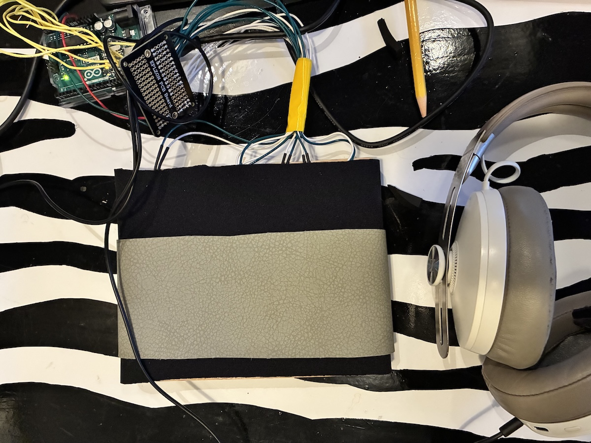
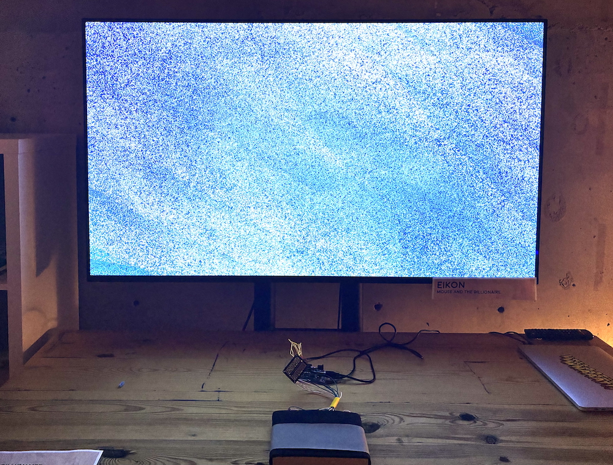
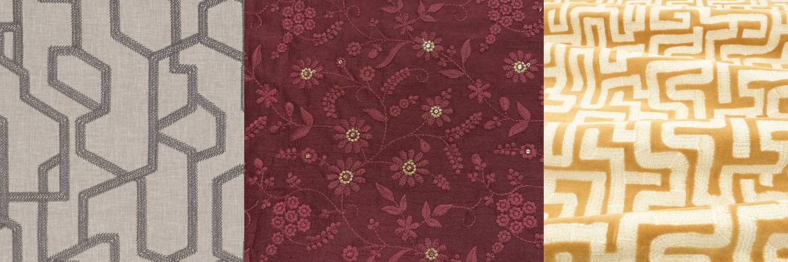
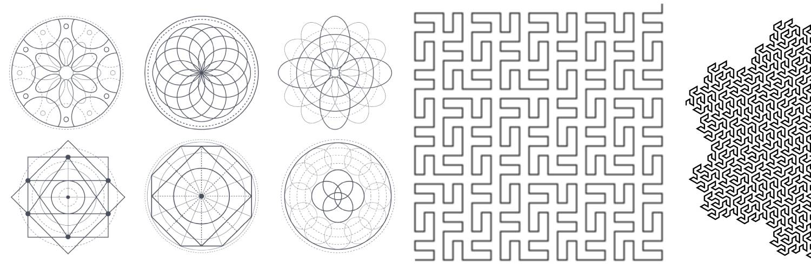

# Process Journal

## 10.01.25 | Why?

This project is a quick turn-around idea for the [2025 Whaaat!? Festival](https://whaaat.io) that is situated in the [playthings](https://github.com/mouseandthebillionaire/planetVelocityMap/blob/main/Proposal/README.md#playthings) section of the thesis work. The core goal here is to explore how the physical interfaces of games can be objects of and vehicles for contemplation. I am thinking specifically of objects of worship and/or ceremonial objects (prayer candles, stained-glass, mandalas, icons[^1], idols, etc) and how they point out to something beyond them, but while this concept can be easily understood from a spiritual context, I think there is also something to be explored about the use of objects for non-spiritual contemplative ends (Japanese tea ceremony being a clear precedent)

Within play then, can objects create a state of contemplation in the player? It's worth being reminded that the working definition for contemplation is the one taken from Djebbara et al where it is a "heightened level of awareness and an intentional focus on the present moment, fostering a state of deep reflection and non-judgmental engagement." This seems fairly reasonable, right? Are players being 'contemplative' when they are intensely focused on their games? I think maybe (?), but for this project I would like to focus on the transference of focus from the object to the external world. 

So, some design goals:
- A physical interface that does not read "game interface"
- Ambiguous visuals and sounds. I don't want the player to feel as they have 'solved' anything
- Extended time - instead it's more about how long they have spent with the object, learning from the micro-movements

## 10.05.25 | Ideation

This image in the top left corner is getting closest to what I am envisioning for this project. I like some of these other ideas as well, but I think the hidden force-sensor grid on a board (with some sort of thick overlay to dissipate the force) allows for some serious ambiguity and therefore time spent with the thing. Additionally, the idea of it being on a board reads a little [prie-dieu](https://churchantiques.com/product/excellent-quality-1910-carved-gothic-oak-small-prie-dieu-from-st-saviours-sunbury-sale/) which I like. 

I think eventually, I would really like this on top of some sort of box, or behind a display area of some sort so that there is a third article that becomes the exact _object_ of contemplation. The experience could change based on what is placed there. Essentially some sort of contemplative [amiibo](https://www.nintendo.com/us/amiibo/) situation.[^2]

First steps:
- Knock up a version that takes in keyboard inputs. I can switch this over to the controller once I build it in Colorado
- Order the components and ship them to Boulder
- Think about the sound/visuals. I have no idea what these will be, and this could easily veer off into screen-saver territory, so I'll have to be a little careful there

## 10.08.25 | Unity Pass

I realized as soon as I started knocking this together that I was going to need the force sensors here to really test this thing[^3]. I also realized when I pulled out the Arduino that it only has six analog inputs, so the sketch I had with twelve isn't going to fly. Theoretically, obviously I could use two arduinos (or a different microcontroller entirely) but I really want this thing to function more as a proof-of-concept, and there's no real need to get too complicated. All that to say, I shipped the FSRs here so that I'll have them by next week to mock some things up.

In the mean-time, I built the back-end of this thing, and have a keyboard setup for testing. It doesn't recognize the force, obviously, but there's a slider to sort of mimic that. The functionality is pretty simple. When you hold down the key (eventually FSR) it starts counting up, and that speed is increased as the force goes up. Should give us a pretty good little number to play with.

I tried getting Claude to quickly spin up a version of [this](https://github.com/Bleuje/interactive-physarum?tab=readme-ov-file), but it was a bit of a disaster. I love the idea, but might be a bit too complicated for this thing anyway. Though maybe for a future iteration. For this sprint I decided to pivot and use the same technique that I used for [Instauratio Exiguus](https://github.com/mouseandthebillionaire/losFinisCDE) which was rely easy to set up, since I've used it a few times. One change I made though, is to use a video instead of text. I've always liked [this video](https://vimeo.com/406428324) that L made, so I grabbed the first section for this. I exported out 36 frames, and then split those into six layers. Then six different sprites just cycle through those frames. Easy peasy! It's a lot of sprites, but hopefully won't be an issue. Now we have control of all those layers to rotate and apply effects (which will be the next step)

There's an immediate worry that the visuals may be a bit _too_ subtle, but I'll start playing with it and maybe do some treatment to the sprites if I need. It also points towards the question of whether or not the _whole thing_ might be too subtle, but it's a delicate balance when you're not trying to hit people over the head with a thing. The textual elements worked really well with IE, so I might go back to that just to have _something_ for people to be pointed to. We'll see.

## 10.09.25 | Interaction Iteration 1

These circles were initially just part of the FSR test setup, but they add some visual interest to the whole thing, so I left them in[^4]. I can see a version of this that is using more ambiguous shapes/interactions, but this feels good for now. I think partly I'm working from an understanding the the Whaaat!? Festival audience (and venue?) may not be the idea place for something 'challenging.' Look at this gif, though, I am struck by the cyclical nature of the circles, which seems kind of nice. Perhaps there is a version where a constant press cycles through this breathe-in-breathe-out looking thing (which is what L suggested last night after seeing it).

Overall, I like it. It's nice to have the thing mostly built so that I can sit with it for a bit and make these iterative changes.

## 10.11.25 | Iteration 2: Pink Triangles

I wanted to test out a different shape and went with these [pink triangles](https://www.youtube.com/watch?v=v2vWDWxYJBc&list=RDv2vWDWxYJBc&start_radio=1). Seeing them in the space then gave me the idea to also have them rotate as they increases in size. I'm also experimenting here with random assigning the FSRs to shapes instead of the ones that make the most sense spatially (upper left to upper left, etc). To help take care of all of this, I created a shapeManager that creates the shapes, lays them out, and assigns the FSRs (rather than the shapes doing so themselves, which is what was happening earlier)

This makes me think that a larger grid of triangles with randomly assigned FSRs could be an interesting interaction. The user places their hands on the board, presses, and then a random assortment of triangles are affected. This would make the whole interaction much more exploratory. You would have to figure out what combination effects the visuals (and sounds) in the way that is most pleasing to you. This assignment could also be done randomly every so often (or after accomplishing some task - say interacting with the system for a certain length of time) Good areas to move forward with, I think. Next!

## 10.13.25

L suggested that the circles are more organic, so even though I'm throwing this one in a grid, by adding in a little bit of offsets in their placement, I think we've got a nice little organic vibe here. Looking at the above image makes me think that I could also slightly modify their base size and colors as well, to give more non-uniformity.

I also wanted the circles to be more organic, so I drew [twenty circles](../Assets/Resources/Circles) that the gameObject is randomly flipping between. A note: this process itself was highly contemplative! I imported a simple circle into procreate, and then drew each circle while exhaling exactly one breath length. Very nice.

I like the way this is looking. It's hard to tell exactly what it's going to feel like without the FSRs, but I tried dragging my finger along the keys I've set to test, and there's a fun wavering that happens (which you can kind of see at the end of the above gif). 

Next, I want to implement the textual koan thing (similar to what I did in [IE](https://github.com/mouseandthebillionaire/losFinisCDE/tree/main/docs/Process#04262025--busy-week)), and see how it feels. I think the plan is to trigger a text when any FSR (or combination) is held for some given time (we'll start with 1 minute?). I was initially going to use Byung-Chul Han's *[The disappearance of rituals](https://www.politybooks.com/bookdetail?book_slug=the-disappearance-of-rituals-a-topology-of-the-present--9781509542758)* due to the very ritualistic feeling of this, but I also thought it might be nice to read a new one *while* I'm making this (rather than reread and select from my notes) and so I have ordered a copy of *[Non-things](https://www.politybooks.com/bookdetail?book_slug=non-things-upheaval-in-the-lifeworld--9781509551699)* (which also feels super appropriate given that this project is in the 'playthings' section of the thesis). It will be nice to read this on the flight to Boulder and see what passages pop out as suitable. 

The final question is what happens visually when (and after) the text is shown, but I think for now I'll just leave it as is. No change!

## 10.21.25 | Whaaat!?-bound

Implemented the Koan thing, and then immediately broke everything trying to import the Audio directly from the IE project. Took a fair amount of time getting it all back in order, but I did it. Then spent the last few days getting the audio all implemented, and I'm almost all set. I leave for Whaaat!? early tomorrow, and just wanted to jot down a few things that I'd like to see in here before I showcase on Saturday:

- It's hard to read the text through the bubbles. We could do it in a darker font, but maybe it's fine? Could do a full transition thing, but that seems like overkill. Something to test in situ
- That being the case, job one is to get the board set up so that we're testing with the actual interface
- Make it so that the cellos sounds are ducked by the phrase riffs
- Might be nice to have the background color gradually transition between hues
- There's not much else going on sound-wise; definitely need to spend some time with the interaction and see where it can be improved and/or pushed further

## 10.23.25 | Hardware

Spent the last 24 hours getting the hardware all up and running. As the above image shows, I laid out the FSRs in a somewhat arbitrary pattern, which I think will work out fine. It all works in the Unity build (and will hopefully stay that way!)

I've also added a fade-in / fade-out for the text. I think this looks fine, but the duration and intensity can be changed as I keep working.

In testing this with DR, I'm starting to think about the interaction a bit more. Right now the increase of the circles corresponds to a volume increase of six cello notes in an a-minor chord. Currently the sound continues once the user lifts up their hands, which I think makes sense as it is tied to the size of the circles, but it means that there isn't as much direct sonic feedback for the player. I'm thinking that rhythmic sounds tied to direct press could work. As you press harder the note triggers become faster. Something to try at least!

## 10.23.24 | Second Hardware Implementation

Once I added the layer of neoprene to the first iteration of this it became clear that the FSRs were both too small and too far apart. The desire was that the force would dissipate through the material and create sections where multiple FSRs could be triggered, but it didn't work quite right. So I ended up moving the FSRs to a smaller board and grouped them closer together. I put them more in a line, and added this faux leather strip to better indicate the touchable space. It still feels exploratory, but not quite as elegant as I would like. But, all in all, for a first showing of this idea, I think it's going to work.[^5]

I wasn't happy with the non-progressive audio - wanting something that a) sounded better, and b) would incentivize people to spend more time with it - so I reimplemented the score from [An Invitation to Play](https://github.com/mouseandthebillionaire/aitp) which fits in nicely. I'm still uncertain if people will actually sit and hold a single FSR for 10 seconds. That seems to be asking a lot. But I'll be able to tweak that once it's installed and I've done some observation.

I also added in an opacity change to the group of circles to better indicate when it has been touched, and this is definitely working better than it was before. We don't see all the circles at once, but I think that's actually nicer?

I still haven't added the color changing effect in the background, but should be easy to get to once I knock out this [Experimental Games Showcase](https://www.experimentalgamesshowcase.com) application. Which is now job 1!

## 10.24.25 | EGS Application 

**Please give us a one paragraph description of the game concept:**

_Eikon_ is a playful exploration in how the physical interfaces of games can be objects of and vehicles for contemplation. Players place their hands on a simple-looking board that can sense the degree of force applied at certain points. By slowly moving their fingers, exploring the contours of the interface, and applying varying degrees of pressure, they are presented with an ever-changing array of abstract minimalist visuals and a complex ambient soundscape. The entire experience echoes the ritualistic aspects of ceremonial objects (prayer candles, tea ceremonies, stained-glass, mandalas, idols, etc) and how they can be used to point out to something larger about the external world. 

**Explain what makes the game experimental (max 200 words)?**

_Eikon_ is the latest piece in an ongoing PhD thesis exploring an aesthetic of 'contemplative play,' a play with the potential to highlight the nature of the world around us, and our place in it. Where many games guide the player through specified challenges and defined narratives, contemplative play points the player toward an openness that invites deeper, more ambiguous introspection, serving as an antidote to an age of fractured attention and instrumentalized leisure.

For the EGS, I would like to discuss _Eikon_ as part of this larger body of work, including *Lest Ten Horizons Cry* and *Instauratio Exiguus*. These projects are specifically designed to instigate contemplative experiences, leveraging non-obvious, obtuse physical interfaces to introduce ambiguity into the gameplay. The player is left to explore what these unfamiliar objects do, spending time investigating the playful environments without explicit goals. This interaction (what philosopher Byung-Chul Han calls *ceremonious inactivity*) brings about a reflective mode that points back to the larger world and the technology we rely on. 

## 10.27.25 | Koans

The Whaaat!? Showcase is over and it went fairly well. I will do a deep debrief (perhaps tomorrow) after I sit with this for a while, but I think there is a lot to learn from this experiment. For now, I just wanted to jot down the text that I had pulled from Byung-Chul Han's *Non-things* and used in this version. The file is [here](../Assets/Resources/Koans.txt), but I thought it would be good to have it in the main process documentation as well.

- We are now in the habit of perceiving reality in terms of attraction and surprise.
- The world is becoming increasingly intangible, cloudlike and ghostly 
- It is not possible to linger on information. It is relevant only fleetingly.
- Information by itself does not illuminate the world
- Today, we pursue information without gaining knowledge
- We take notice of everything without gaining any insight
- We travel across the world without having an experience
- We communicate incessantly without participating in community
- We collect vast quantities of data without following up on our recollections
- We accumulate friends and followers without meeting an other
- A machine does not free the hand from work, but an informaton does
- We prefer experiencing to possessing being to having
- The more I experience, the more I am 
- Fate has no place in the digital order 
- Without bodily touch, no ties can emerge 
- The time of things is past 
- Through all my swiping, I submit the world to my needs 
- The truly beautiful cannot be touched. It demands distance

## 10.28.15 | Whaaat!? Post-mortem

Thoughts and reflections after showing this piece last weekend, in no order particular order

- I find myself in the strange situation where I am making things that (if I were seeing it as an outsider) I would probably think were dumb. It looked good. It sounded great. But it's off. It's too on the nose. It's too new-agey, perhaps? The whole approach to contemplation feels off and/or obvious.
- I think for me the texts are one of the main culprits. What feels deep and thought-provoking on the written page (and in context with the rest of the material) feels a little wooey in isolation. It's not terrible; it's just that I feel like I can do better than this. One possible way forward would have this be more narrative. When you unlock a section it tells the next part of the story. The problem obviously being that the story had better be well-written. The problem also being that it would be easy to rely or fall back on seemingly 'powerful' stories, which seems like cheating. What might a version of this feel like with a story from EJB embedded in here? Worth an iteration, I think.
- While showing this, I kept thinking about the experience of [IE](https://github.com/mouseandthebillionaire/losFinisCDE) which I think was more successful. Obviously the interface was more robust (having been built over a longer time-frame), but I think the interaction was also better. There's something to be said for the 'puzzly' aspect of finding the correct location. Could there be a version of this where you are more guided to finding locations on the mat. The current exploration-style is good, but perhaps too open. 
- The fingers on the mat also make me think about [Digital Yoga](https://github.com/mouseandthebillionaire/digitalYoga) (as do the circles, [as I mentioned earlier](^4)) which I think could make for an interesting mash-up. The original DY clearly marked where you were supposed to put your fingers, but this could be a version where you see what's happening on the screen and are trying to mimic that placement on the mat. Much more possibility for playfulness (and definitely humor). Not sure if that's a worth-while direction to go in, but perhaps. If so, I think it would be best to have it be _mechanically_ influenced, rather than _thematically_.
- The other idea that I have batted around is that [amiibo situation](## 10.05.25 | Ideation) from the original ideation which I still think has some legs. The objects themselves would have to be meaningful. But it definitely speaks to the play-thing aspect. Or does it? If you are hiding a thing in the box, are you playing with it? I suppose so? Either way, still want to think on this for future iterations.
- In all of this, I think the big question is "how do you add back the PLAY part of contemplative play?" It's (generally) easy to make something fun. It's (somewhat) easy to make something thoughtful. But how do you do both?
- Lastly, people really wanted to poke at this thing. They are either too used to phones, game-controllers, or are too timid to lay their hands on top of the mat. They would much rather prod at it, which I don't think lends itself to the contemplative aspects of the thing? But I could be wrong!

## 10.30.25 | Moving Forward

Reflecting on this more (and in conversation with PB) and wondering how to best move this forward and I'm left with two big questions. First, is it possible to put the 'play' back in 'contemplative play?' Second, how do you get people to touch the thing in the 'appropriate' way.

I have been invited to show a thing at the [Radio Snack] birthday party event, so I think I will do another pass at this and see if I can't solve these nagging questions. Ideation brewing and more to come.

Onward!

## 11.20.25 | New Hardware

Rebuilt the hardware side of this into an old cigar box. This makes it possible for me to hide the electronic inside, which is obviously a slicker presentation. Doesn't read prie-dieu to me as much as the plank of wood did, but overall better. Upgraded the FSRs to the larger ones, which creates a more responsive experience.[^6]

Thinking about the user-experience with this - specifically with getting folks to "touch" it rather than "poke" it - and ND suggested adding material on top that suggested movement or progression. In other words, if there was a paisley fabric on top of this, or a fabric printed with the image of a [medieval labyrinth](https://www.janeclayton.co.uk/media/catalog/product/cache/04f3c6c3e6655e7be184d6c72b803cfa/l/a/labyrinth-zinc-hunting-fabric-z801-04-image01.jpg) would that encourage the proper movement? And I think it would! So next steps is thinking about what fabric exactly to use. The one linked above is clearly great, but there's no time to wait for that to arrive! Worst case scenario, I use sharpie on the faux leather I already have (haha), but maybe there's time to stitch something together? Embroider a thing? Either way, that might be a good route to go eventually.

Next:
- Sketch out possible designs for the top
- Attach the covering. In talking with ND, he suggested removing the neoprene, but these new FSRs work so well, that it actually works better to keep the neoprene on there. I might test with other material to see what we get, but with the limited time I have, that might have to wait for later
- The repetitive chimes are too fast. Need to separate them out more
- Everything might be too fast?
- Experiment with shorter, more obtuse text for the koans
- Add found sounds?

## 11.20.25 | Rewritten Koans

I have broken up the koans to be shorter, but I'm not sure how I feel about it. They're definitely thought-provoking, but now because I've switched the middle section from being Han's description of society's faults ("We take notice of everything without gaining any insight") to a more prescriptive voice ("take notice of everything," "gain no insight") it reads as this unreliable narrator. I kind of like it? It's weird? It'll work for now

- the habit of perceiving reality
- attraction and surprise
- increasingly intangible
- cloudlike
- ghostly 
- linger on information
- relevant only fleetingly
- information does not illuminate
- pursue information
- gain no knowledge
- take notice of everything
- gain no insight
- travel across the world
- having no experience
- communicate incessantly
- don't participate in community
- collect vast quantities of data
- don't following up on recollections
- accumulate friends and followers
- don't meet an other
- a machine does not free the hand from work
- an informaton
- we prefer experiencing to possessing
- we prefer being to having
- the more I experience, the more I am 
- fate has no place in the digital order 
- without bodily touch, no ties can emerge 
- the time of things is past 
- through swiping, I submit the world to my needs 
- the truly beautiful cannot be touched
- it demands distance

## 11.21.25 | Material Ideation

It would be nice to have an organic pattern and/or texture that the user could trace. It would be even _more_ nice if that texture actually translated to some sort of meaningful visual/sonic interaction, but for now, I think the illusion of linkage is enough. The image above is of a few fabrics that I found that I think communicate this nicely.

Sacred geometry is definitely another really good avenue for exploration here. It would be nice if I could find some material with these images already printed on them, but the cursory search I did online proved fruitless. As a backup I ordered a couple of [mousepads with topographic lines on them](https://www.amazon.ca/Large-Mouse-Pad-Desk-Line-23-6x11-8/dp/B0D3PVJ34C/ref=pd_day0_d_sccl_2_7/130-4265813-4313831?pd_rd_w=YnL7n&content-id=amzn1.sym.4531c9b5-9484-432d-bb61-13ea8c47decb&pf_rd_p=4531c9b5-9484-432d-bb61-13ea8c47decb&pf_rd_r=KWABE76TGRNV17HM9MNP&pd_rd_wg=MB3R3&pd_rd_r=50c5d81f-cea0-4eb1-abde-c1c6725d498f&pd_rd_i=B0CZNPNY5Y&th=1) that should do in a pinch. 

For now, I'm going to go out and hit the Salvation Army to scour their collection of old people clothes and upholstered furniture and hope that I strike gold!

## 11.22.25 | V3

The mouse pads ended up being the best solution here as far as visuals plus texture. Most of these shapes line up to where the FSRs are which is nice. I especially like the little island in the upper left hand corner that aligns with the small FSR. I am debating adding some more marks (specifically in the upper right corner) to indicate where the pressing should happen, but not sure if it is necessary. The Radio Snack showcase is tonight, and hopefully it goes over well enough. Bringing headphones and a headphone amp to make sure it can be heard over what I assume will be a lot of noise. We'll see!

## 12.01.25 | V3 Exhibition Thoughts

Spent the last week reflecting on the Radio Snack exhibition, and just wanted to jot down some thoughts. It went fairly well. A dozen or so people spent some time with the project, and I think generally the reactions were far more positive than they had been at Whaaat!?. I'm not sure if this audience was more receptive to the ideas, or if it was the changes that I had made, but either way, a better showing. 

I will say that the patterned covering on the box definitely seems like a better fit. People were much more inclined to _place_ their fingers (rather than poke), but again, not sure if this is an audience thing or a form-factor thing. Additionally, I changed the description text slightly, and that seemed to better instruct? Addressing "you" rather than "the player" is a better fit in the exhibition context, perhaps?

>_Eikon_ is a playful study in how the physical interfaces of games can be objects of an vehicles for contemplation. Rest your hands on the box. Explore the contours of the interface and apply varying degrees of pressure as an ever-shifting field of minimalist visuals unfolds alongside a layered ambient soundscape. 

>The experience recalls the ritualistic presence of ceremonial objects - prayer candles, tea ceremonies, stained glass, mandalas, idols - objects that center attention and open a space for reflecting on something beyond the immediate world.

This feels like a good final stage for this. I can see future projects that build on these ideas, but as far as the experiment of creating an experience that foregrounds ambience, subtle movements, and a time requirement? Done and done.

---
## Notes

[^1]: Hence the repo name...
[^2]: Which, not gonna lie, not a terrible idea, Haha
[^3]: If I've learned one thing from teaching, it's don't count on things to work out down the road...
[^4]: The whole thing also feels very [Digital Yoga](https://github.com/mouseandthebillionaire/digitalYoga) which is a fun throwback - if only just for me
[^5]: Fingers crossed 
[^6]: Except that one little tiny one because I fried my 6th larger FSR trying to solder directly to it!
