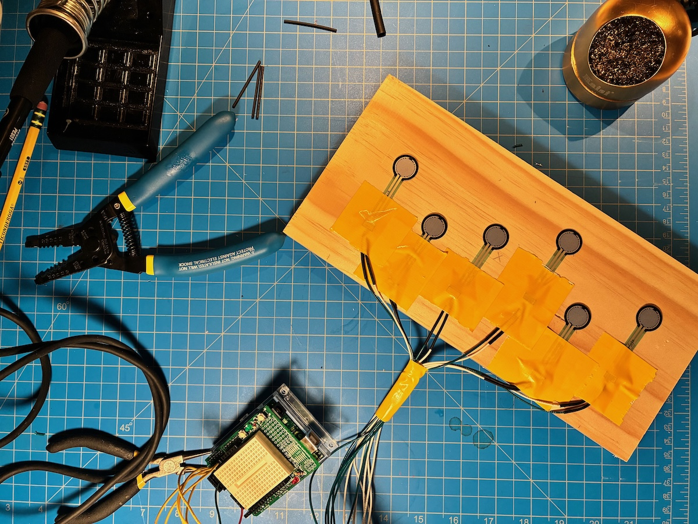

# Process Journal

## 10.01.25 | Why?

This project is a quick turn-around idea for the [2025 Whaaat!? Festival](https://whaaat.io) that is situated in the [playthings](https://github.com/mouseandthebillionaire/planetVelocityMap/blob/main/Proposal/README.md#playthings) section of the thesis work. The core goal here is to explore how the physical interfaces of games can be objects of and vehicles for contemplation. I am thinking specifically of objects of worship and/or ceremonial objects (prayer candles, stained-glass, mandalas, icons[^1], idols, etc) and how they point out to something beyond them, but while this concept can be easily understood from a spiritual context, I think there is also something to be explored about the use of objects for non-spiritual contemplative ends (Japanese tea ceremony being a clear precedent)

Within play then, can objects create a state of contemplation in the player? It's worth being reminded that the working definition for contemplation is the one taken from Djebbara et al where it is a "heightened level of awareness and an intentional focus on the present moment, fostering a state of deep reflection and non-judgmental engagement." This seems fairly reasonable, right? Are players being 'contemplative' when they are intensely focused on their games? I think maybe (?), but for this project I would like to focus on the transference of focus from the object to the external world. 

So, some design goals:
- A physical interface that does not read "game interface"
- Ambiguous visuals and sounds. I don't want the player to feel as they have 'solved' anything
- Extended time - instead it's more about how long they have spent with the object, learning from the micro-movements

## 10.05.25 | Ideation

This image in the top left corner is getting closest to what I am envisioning for this project. I like some of these other ideas as well, but I think the hidden force-sensor grid on a board (with some sort of thick overlay to dissipate the force) allows for some serious ambiguity and therefore time spent with the thing. Additionally, the idea of it being on a board reads a little [prie-dieu](https://churchantiques.com/product/excellent-quality-1910-carved-gothic-oak-small-prie-dieu-from-st-saviours-sunbury-sale/) which I like. 

I think eventually, I would really like this on top of some sort of box, or behind a display area of some sort so that there is a third article that becomes the exact _object_ of contemplation. The experience could change based on what is placed there. Essentially some sort of contemplative [amiibo](https://www.nintendo.com/us/amiibo/) situation.[^2]

First steps:
- Knock up a version that takes in keyboard inputs. I can switch this over to the controller once I build it in Colorado
- Order the components and ship them to Boulder
- Think about the sound/visuals. I have no idea what these will be, and this could easily veer off into screen-saver territory, so I'll have to be a little careful there

## 10.08.25 | Unity Pass

I realized as soon as I started knocking this together that I was going to need the force sensors here to really test this thing[^3]. I also realized when I pulled out the Arduino that it only has six analog inputs, so the sketch I had with twelve isn't going to fly. Theoretically, obviously I could use two arduinos (or a different microcontroller entirely) but I really want this thing to function more as a proof-of-concept, and there's no real need to get too complicated. All that to say, I shipped the FSRs here so that I'll have them by next week to mock some things up.

In the mean-time, I built the back-end of this thing, and have a keyboard setup for testing. It doesn't recognize the force, obviously, but there's a slider to sort of mimic that. The functionality is pretty simple. When you hold down the key (eventually FSR) it starts counting up, and that speed is increased as the force goes up. Should give us a pretty good little number to play with.

I tried getting Claude to quickly spin up a version of [this](https://github.com/Bleuje/interactive-physarum?tab=readme-ov-file), but it was a bit of a disaster. I love the idea, but might be a bit too complicated for this thing anyway. Though maybe for a future iteration. For this sprint I decided to pivot and use the same technique that I used for [Instauratio Exiguus](https://github.com/mouseandthebillionaire/losFinisCDE) which was rely easy to set up, since I've used it a few times. One change I made though, is to use a video instead of text. I've always liked [this video](https://vimeo.com/406428324) that L made, so I grabbed the first section for this. I exported out 36 frames, and then split those into six layers. Then six different sprites just cycle through those frames. Easy peasy! It's a lot of sprites, but hopefully won't be an issue. Now we have control of all those layers to rotate and apply effects (which will be the next step)

There's an immediate worry that the visuals may be a bit _too_ subtle, but I'll start playing with it and maybe do some treatment to the sprites if I need. It also points towards the question of whether or not the _whole thing_ might be too subtle, but it's a delicate balance when you're not trying to hit people over the head with a thing. The textual elements worked really well with IE, so I might go back to that just to have _something_ for people to be pointed to. We'll see.

## 10.09.25 | Interaction Iteration 1

These circles were initially just part of the FSR test setup, but they add some visual interest to the whole thing, so I left them in[^4]. I can see a version of this that is using more ambiguous shapes/interactions, but this feels good for now. I think partly I'm working from an understanding the the Whaaat!? Festival audience (and venue?) may not be the idea place for something 'challenging.' Look at this gif, though, I am struck by the cyclical nature of the circles, which seems kind of nice. Perhaps there is a version where a constant press cycles through this breathe-in-breathe-out looking thing (which is what L suggested last night after seeing it).

Overall, I like it. It's nice to have the thing mostly built so that I can sit with it for a bit and make these iterative changes.

## 10.11.25 | Iteration 2: Pink Triangles

I wanted to test out a different shape and went with these [pink triangles](https://www.youtube.com/watch?v=v2vWDWxYJBc&list=RDv2vWDWxYJBc&start_radio=1). Seeing them in the space then gave me the idea to also have them rotate as they increases in size. I'm also experimenting here with random assigning the FSRs to shapes instead of the ones that make the most sense spatially (upper left to upper left, etc). To help take care of all of this, I created a shapeManager that creates the shapes, lays them out, and assigns the FSRs (rather than the shapes doing so themselves, which is what was happening earlier)

This makes me think that a larger grid of triangles with randomly assigned FSRs could be an interesting interaction. The user places their hands on the board, presses, and then a random assortment of triangles are affected. This would make the whole interaction much more exploratory. You would have to figure out what combination effects the visuals (and sounds) in the way that is most pleasing to you. This assignment could also be done randomly every so often (or after accomplishing some task - say interacting with the system for a certain length of time) Good areas to move forward with, I think. Next!

## 10.13.25

L suggested that the circles are more organic, so even though I'm throwing this one in a grid, by adding in a little bit of offsets in their placement, I think we've got a nice little organic vibe here. Looking at the above image makes me think that I could also slightly modify their base size and colors as well, to give more non-uniformity.

I also wanted the circles to be more organic, so I drew [twenty circles](../Assets/Resources/Circles) that the gameObject is randomly flipping between. A note: this process itself was highly contemplative! I imported a simple circle into procreate, and then drew each circle while exhaling exactly one breath length. Very nice.

I like the way this is looking. It's hard to tell exactly what it's going to feel like without the FSRs, but I tried dragging my finger along the keys I've set to test, and there's a fun wavering that happens (which you can kind of see at the end of the above gif). 

Next, I want to implement the textual koan thing (similar to what I did in [IE](https://github.com/mouseandthebillionaire/losFinisCDE/tree/main/docs/Process#04262025--busy-week)), and see how it feels. I think the plan is to trigger a text when any FSR (or combination) is held for some given time (we'll start with 1 minute?). I was initially going to use Byung-Chul Han's *[The disappearance of rituals](https://www.politybooks.com/bookdetail?book_slug=the-disappearance-of-rituals-a-topology-of-the-present--9781509542758)* due to the very ritualistic feeling of this, but I also thought it might be nice to read a new one *while* I'm making this (rather than reread and select from my notes) and so I have ordered a copy of *[Non-things](https://www.politybooks.com/bookdetail?book_slug=non-things-upheaval-in-the-lifeworld--9781509551699)* (which also feels super appropriate given that this project is in the 'playthings' section of the thesis). It will be nice to read this on the flight to Boulder and see what passages pop out as suitable. 

The final question is what happens visually when (and after) the text is shown, but I think for now I'll just leave it as is. No change!

## 10.21.25 | Whaaat!?-bound

Implemented the Koan thing, and then immediately broke everything trying to import the Audio directly from the IE project. Took a fair amount of time getting it all back in order, but I did it. Then spent the last few days getting the audio all implemented, and I'm almost all set. I leave for Whaaat!? early tomorrow, and just wanted to jot down a few things that I'd like to see in here before I showcase on Saturday:

- It's hard to read the text through the bubbles. We could do it in a darker font, but maybe it's fine? Could do a full transition thing, but that seems like overkill. Something to test in situ
- That being the case, job one is to get the board set up so that we're testing with the actual interface
- Make it so that the cellos sounds are ducked by the phrase riffs
- Might be nice to have the background color gradually transition between hues
- There's not much else going on sound-wise; definitely need to spend some time with the interaction and see where it can be improved and/or pushed further

## 10.23.25 | Hardware

Spent the last 24 hours getting the hardware all up and running. As the above image shows, I laid out the FSRs in a somewhat arbitrary pattern, which I think will work out fine. It all works in the Unity build (and will hopefully stay that way!)

I've also added a fade-in / fade-out for the text. I think this looks fine, but the duration and intensity can be changed as I keep working.

In testing this with DR, I'm starting to think about the interaction a bit more. Right now the increase of the circles corresponds to a volume increase of six cello notes in an a-minor chord. Currently the sound continues once the user lifts up their hands, which I think makes sense as it is tied to the size of the circles, but it means that there isn't as much direct sonic feedback for the player. I'm thinking that rhythmic sounds tied to direct press could work. As you press harder the note triggers become faster. Something to try at least!

---
## Notes

[^1]: Hence the repo name...
[^2]: Which, not gonna lie, not a terrible idea, Haha
[^3]: If I've learned one thing from teaching, it's don't count on things to work out down the road...
[^4]: The whole thing also feels very [Digital Yoga](https://github.com/mouseandthebillionaire/digitalYoga) which is a fun throwback - if only just for me