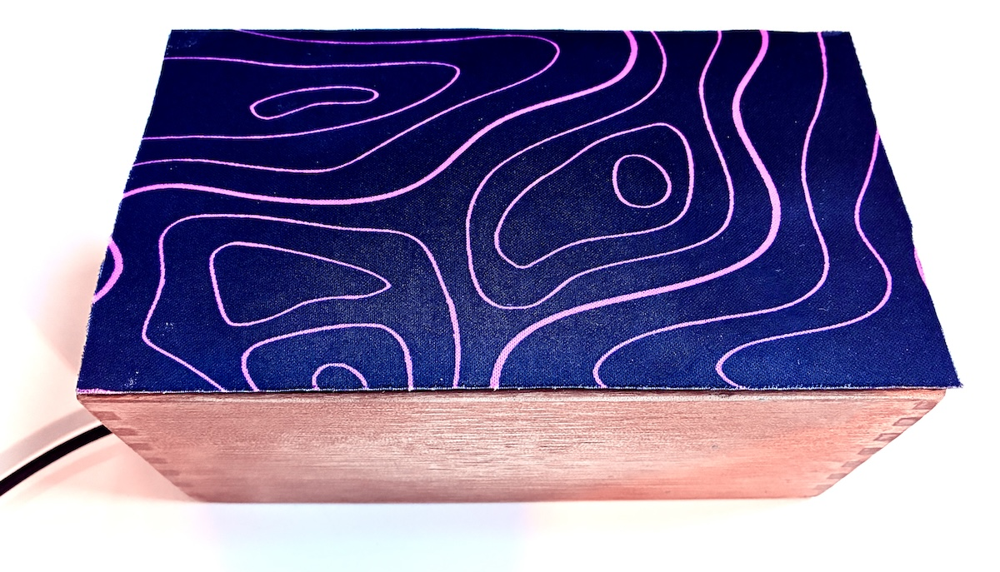

# Eikon

_Eikon_ is a playful study in how the physical interfaces of games can be objects of an vehicles for contemplation. Rest your hands on the box. Explore the contours of the interface and apply varying degrees of pressure as an ever-shifting field of minimalist visuals unfolds alongside a layered ambient soundscape. 

The experience recalls the ritualistic presence of ceremonial objects - prayer candles, tea ceremonies, stained glass, mandalas, idols - objects that center attention and open a space for reflecting on something beyond the immediate world.

## Miscellaneous Material
* [Process Documentation](Process/Journal.md)